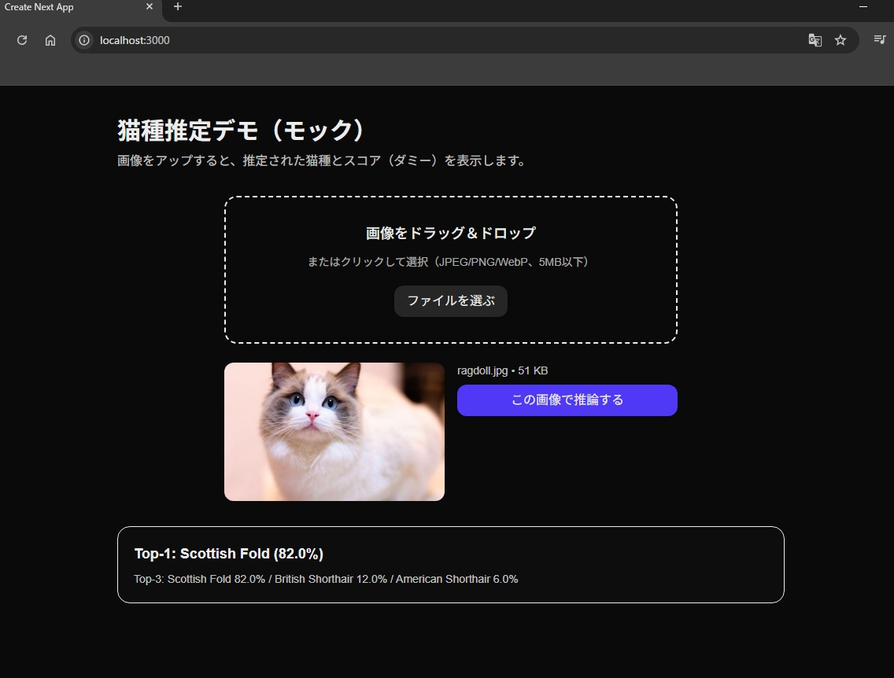

# 🗓 Week 1：環境構築・フロント＆バックエンド接続

## 🎯 目的
猫種回帰アプリの基盤を構築する。  
フロント（Next.js）とバックエンド（FastAPI）を作成し、  
画像アップロード→API経由で結果を受け取る流れを完成させる。

---

## ✅ 成果物
| 項目 | 内容 |
|------|------|
| フロント | Next.js（App Router, Tailwind, TypeScript） |
| バックエンド | FastAPI（CORS対応, `/predict`, `/healthz`） |
| 通信確認 | フロントからPOSTで画像送信→JSON受信OK |
| 結果表示 | ダミー推論結果をUIに表示 |
| 開発環境 | Node.js + Python + 仮想環境（venv） |

---

## 📂 ディレクトリ構成
```bash
catbreed-portfolio/
├── backend/
│ └── app/
│   └── main.py
│
├── frontend/
│ ├── app/
│ │ ├── components/Upload.tsx
│ │ └── page.tsx
│ └── .env.local
│
└── docs/Week1_setup.md
```
---

## ⚙️ 使用技術
- **フロント:** Next.js, TypeScript, TailwindCSS, App Router
- **バックエンド:** FastAPI, Uvicorn, Pillow, python-multipart
- **通信:** fetch(FormData), CORS設定
- **環境:** Node 18+, Python 3.11+, Windows PowerShell

---

## 🧱 実装ステップ

### 1. フロントエンド雛形作成
```bash
cd /Portfolio
npx create-next-app@latest catbreed-portfolio-frontend
```
推奨設定：TypeScript / ESLint / Tailwind / App Router
実行確認：npm run dev → http://localhost:3000

### 2. ディレクトリ整備
```bash
mkdir catbreed-portfolio
mv catbreed-portfolio-frontend catbreed-portfolio/frontend
```

### 3. UI作成
app/components/Upload.tsx
→ ドラッグ＆ドロップ＋ファイル選択＋プレビュー表示
app/page.tsx
→ ダミー推論結果を表示

### 4. バックエンド作成
```bash
cd backend
python -m venv .venv
.\.venv\Scripts\Activate.ps1
pip install fastapi "uvicorn[standard]" pillow python-multipart
```

app/main.py
```python
@app.post("/predict")
async def predict(file: UploadFile = File(...)):
    return {
        "top1": {"breed": "Scottish Fold", "score": 0.82},
        "top3": [
            {"breed": "Scottish Fold", "score": 0.82},
            {"breed": "British Shorthair", "score": 0.12},
            {"breed": "American Shorthair", "score": 0.06},
        ],
    }
```
起動確認：uvicorn app.main:app --reload --port 8000
健康確認：http://localhost:8000/healthz → { "ok": true }

### 5. フロントと接続
.env.local
```ini
NEXT_PUBLIC_API_URL=http://localhost:8000
```
Upload.tsx の fetch 呼び出しをAPI優先に変更
npm run dev → 実画像アップロードでダミー結果表示OK

---

🧩 確認スクリーンショット



---

### 🧩Week1の成果まとめ
| 項目               | 状態     |
| ---------------- | ------ |
| Next.js フロント構築   | ✅ 完了   |
| FastAPI バックエンド構築 | ✅ 完了   |
| 通信（fetch / CORS） | ✅ 成功   |
| UIデザイン基盤         | ✅ 完成   |
| ダミー推論表示          | ✅ 確認済み |
