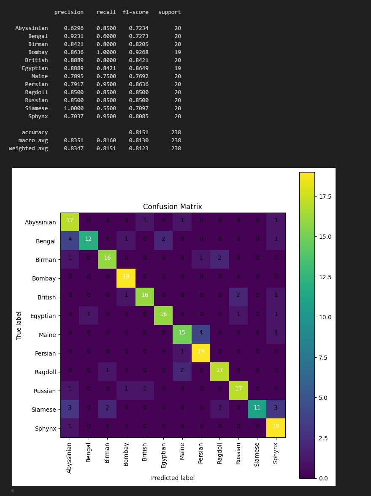
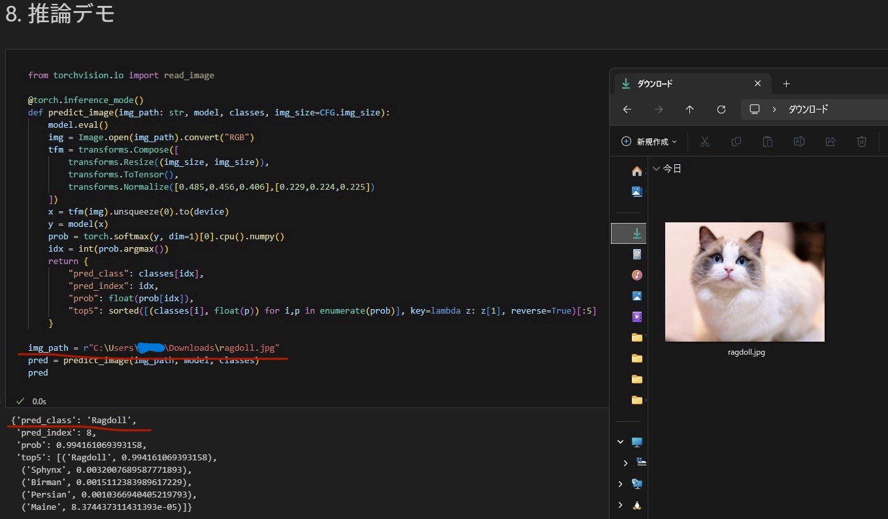

# 🗓 Week 3：猫種分類モデルの学習・評価・推論

## 🎯 目的
Week2で前処理したデータセットを用いて、
転移学習により猫種分類モデルを学習・評価・推論できるようにする。
ResNet50をベースに学習を実施し、最終的に推論可能な .pt モデルを出力する。

---

## ✅ 成果物
| 項目         | 内容                                       |
| ---------- | ---------------------------------------- |
| 学習Notebook | `Week3_01_train_catbreed_model.ipynb`    |
| 学習済みモデル    | `best.pt`（ResNet50 / 12クラス分類）            |
| クラス名リスト    | `classes.json`                           |
| 設定ファイル     | `config.json`（ハイパーパラメータ・ディレクトリ情報）        |
| 学習履歴       | `history.json`（epochごとのacc, f1, lossを記録） |
| 評価結果       | 精度：accuracy ≈ 81.5%、macro-F1 ≈ 0.81      |
| 推論デモ       | 任意の画像に対して猫種分類結果を出力                       |

---

## 📂 ディレクトリ構成
```bash
catbreed-portfolio/
├── backend/
│   ├── app/
│   │   └── main.py
│   │
│   ├── data/
│   │   └── oxford-iiit-pet/
│   │       ├── raw/
│   │       └── processed_cats/
│   │           ├── train/
│   │           ├── val/
│   │           └── test/
│   │
│   ├── notebooks/
│   │   ├── Week2_01_dataset_preparation_backend_layout.ipynb
│   │   └── Week3_01_train_catbreed_model.ipynb
│   │
│   ├── notebooks/
│   │   └── artifacts/
│   │       └── week3/
│   │           └── run_20251109_151018/
│   │               ├── best.pt
│   │               ├── classes.json
│   │               ├── config.json
│   │               └── history.json
│   │
│   └── .venv/
│
├── frontend/
│   └── （Week1と同様）
│
└── docs/
    ├── Week1_setup.md
    ├── Week2_setup.md
    └── Week3_setup.md
```

---

## ⚙️ 使用技術

- **フレームワーク:** PyTorch
- **モデル:** ResNet50（torchvision.models.resnet50, ImageNet事前学習済み）
- **データセット:** Oxford-IIIT Pet Dataset（猫12種）
- **前処理:** torchvision.transforms（Resize, Normalize, RandomFlip）
- **学習管理:** tqdm, scikit-learn, pandas
- **評価:** accuracy, macro-F1, confusion matrix
- **推論:** Torch AMP対応（mixed precision）
- **Notebook:** Jupyter + VSCode（backend/.venv カーネル）

---

## 🧱 実装ステップ

### 1. Notebook作成
```bash
backend/notebooks/Week3_01_train_catbreed_model.ipynb
```
目的：
- **転移学習モデル構築（ResNet50）**
- **train/val/testで学習・評価**
- **学習履歴の保存、モデル出力、推論テスト**

### 2. Config設定
Notebook内で以下の設定を確認・調整：
```python
data_dir = "../data/oxford-iiit-pet/processed_cats"
model_name = "resnet50"
epochs = 15
batch_size = 32
```
→ processed_cats/train・val・test 構成を正しく認識するように修正。
出力先は自動で artifacts/week3/run_日付時刻/ に作成。

### 3. データローダ確認
実行結果：
```bash
Inferred classes from train subdirs: 12
num_classes: 12
Detected classes: ['Abyssinian', 'Bengal', 'Birman', ...]
```
→ 正しく12猫種が検出されることを確認。

### 4. モデル構築
```python
from torchvision import models
model = models.resnet50(weights="IMAGENET1K_V1")
in_features = model.fc.in_features
model.fc = torch.nn.Linear(in_features, 12)
```
出力：
```bash
(23532620, 'ResNet')
```
ResNet50モデルが正しく構築され、学習対象パラメータ数も出力される。

### 5. 学習ループ
AMP（自動混合精度）を有効化し、15epochで学習。
```bash
Epoch 1/15 ... val_acc=0.22
Epoch 3/15 ... val_acc=0.67
Epoch 11/15 ... val_acc=0.78
Epoch 14/15 ... val_acc=0.81
```
→ 最終精度 約81.5%、best.pt が保存される。

### 6. モデル評価
```bash
accuracy : 0.815
macro avg f1 : 0.813
```
混同行列で主要クラスの精度を可視化。
Bombay, Persian, Egyptian などは高精度、Bengal, Maine がやや混同。



### 7. モデル・設定保存
```bash
artifacts/week3/run_20251109_151018/
├── best.pt
├── classes.json
├── config.json
└── history.json
```
→ クラス名やハイパーパラメータを保存して再利用可能。

### 8. 推論テスト
任意画像に対して推論。
```bash
pred = predict_image("C:/Users/.../Downloads/ragdoll.jpg", model, classes)
```
出力例：
```bash
{'pred_class': 'Persian', 'prob': 0.60, 'top5': [('Persian', 0.60), ('Maine', 0.31), ...]}
```
モデルの推論が正常に動作し、信頼度付きの上位5クラスが出力される。



---

## 🧩 Week3の成果まとめ
| 項目                       | 状態       |
| ------------------------ | -------- |
| 転移学習モデル構築（ResNet50）      | ✅ 完了     |
| データローダ設定                 | ✅ 完了     |
| AMP学習・早期終了               | ✅ 実装済み   |
| 評価（accuracy / F1 / 混同行列） | ✅ 出力確認   |
| モデル保存 (`best.pt`)        | ✅ 成功     |
| 推論デモ                     | ✅ 動作確認済み |
| artifacts出力管理            | ✅ 完了     |
