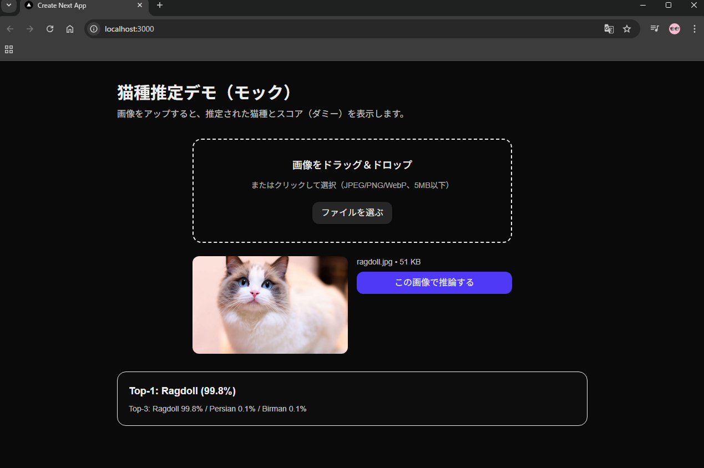

# 🗓 Week 4：モデル推論APIとフロント接続

## 🎯 目的
Week3で学習・保存した猫種分類モデル（`best.pt`）を用いて、  
FastAPI経由で推論APIを構築し、フロントエンドと連携して画像分類結果を表示する。
また、推論結果のTop-3出力に対応し、UI上でリアルタイムに確認できるようにする。

---

## ✅ 成果物
| 項目 | 内容 |
|------|------|
| 推論API | `backend/api/predict.py` |
| モデル自動読み込み | `best.pt` を `artifacts/week3/run_日付/` から自動検出 |
| 推論処理 | 入力画像を前処理 → モデル推論 → Top-3確率を算出 |
| API動作確認 | Swagger UI（`http://127.0.0.1:8000/docs`） |
| フロント接続 | `app/components/Upload.tsx` からAPI呼び出し |
| 結果表示 | Next.js画面でTop-1 / Top-3スコアを可視化 |
| 環境変数設定 | `.env.local` に `NEXT_PUBLIC_API_URL=http://127.0.0.1:8000` |
| 動作確認 | UI上で画像アップロード→推論→結果表示（99.8% Ragdollなど） |

---

## 📂 ディレクトリ構成
```bash
catbreed-portfolio/
├── backend/
│   ├── api/
│   │   └── predict.py
│   │
│   ├── notebooks/
│   │   └── artifacts/
│   │       └── week3/
│   │           └── run_20251109_151018/
│   │               ├── best.pt
│   │               ├── classes.json
│   │               ├── config.json
│   │               └── history.json
│   │
│   └── .venv/
│
├── frontend/
│   ├── app/
│   │   ├── page.tsx
│   │   └── components/
│   │       └── Upload.tsx
│   │
│   ├── .env.local
│   └── package.json
│
└── docs/
    ├── Week1_setup.md
    ├── Week2_setup.md
    ├── Week3_setup.md
    └── Week4_setup.md
```

---

## ⚙️ 使用技術
- **バックエンド:** FastAPI + PyTorch
- **フロントエンド:** Next.js（App Router構成, TypeScript, TailwindCSS）
- **通信:** Fetch API
- **モデル:** ResNet50（Week3で学習済み）
- **推論処理:** torch.softmax, torch.topk による確率算出
- **環境変数:** .env.local に API のURLを定義

---

## 🧱 実装ステップ

### 1. 推論API構築（FastAPI）

作成ファイル：
```bash
backend/api/predict.py
```
主な処理内容：
```python
@app.post("/predict")
async def predict(file: UploadFile = File(...)):
    image = Image.open(io.BytesIO(await file.read())).convert("RGB")
    img_tensor = transform(image).unsqueeze(0).to(device)
    with torch.no_grad():
        outputs = model(img_tensor)
        probs = torch.softmax(outputs, dim=1)[0]
        topk = torch.topk(probs, k=3)
    ...
```
- **✅** モデルの自動ロード
- **✅** クラス名12種を対応付け
- **✅** torch.topk() によりTop-3確率を返却

Swagger UI上で動作確認：
```arduino
http://127.0.0.1:8000/docs
```
→ 画像をアップロードすると
{"top1": {"class_name": "Ragdoll", "confidence": 0.998}, "top3": [...]}
が返却される。

### 2. フロント接続

実装ファイル：
```bash
frontend/app/components/Upload.tsx
```
修正ポイント：
- **onClickAnalyze 内で fetch(${API_URL}/predict) を呼び出し**
- **APIレスポンスを整形して onResult に渡す**
- **推論中は「解析中...」とボタンUIを切り替え**

.env.local：
```bash
NEXT_PUBLIC_API_URL=http://127.0.0.1:8000
```
実行：
```bash
npm run dev
```
ブラウザで http://localhost:3000 を開くと、
画像をアップロードして推論が実行され、結果が即座に表示される。

### 3. Top-3対応

predict.py にて以下を実装：
```python
probs = torch.softmax(outputs, dim=1)[0]
topk = torch.topk(probs, k=3)
top3 = [{"class_name": CLASSES[i], "confidence": round(float(v), 4)} for i, v in zip(topk.indices, topk.values)]
return {"top1": top3[0], "top3": top3}
```
top3 の配列をUIに表示可能に。

結果表示例：
```less
Top-1: Ragdoll (99.8%)
Top-3: Ragdoll 99.8% / Persian 0.1% / Birman 0.1%
```



---

## 🧩 Week4の成果まとめ
| 項目                | 状態                        |
| ----------------- | ------------------------- |
| FastAPIによる推論API構築 | ✅ 完了                      |
| モデル自動ロード          | ✅ 実装済み                    |
| 画像アップロードAPI呼び出し   | ✅ 成功                      |
| CORS設定（Next.js接続） | ✅ 確認済み                    |
| フロントUI修正          | ✅ 完了                      |
| Top-3出力対応         | ✅ 実装済み                    |
| 全体動作確認            | ✅ 「Ragdoll」画像で正常推論（99.8%） |
