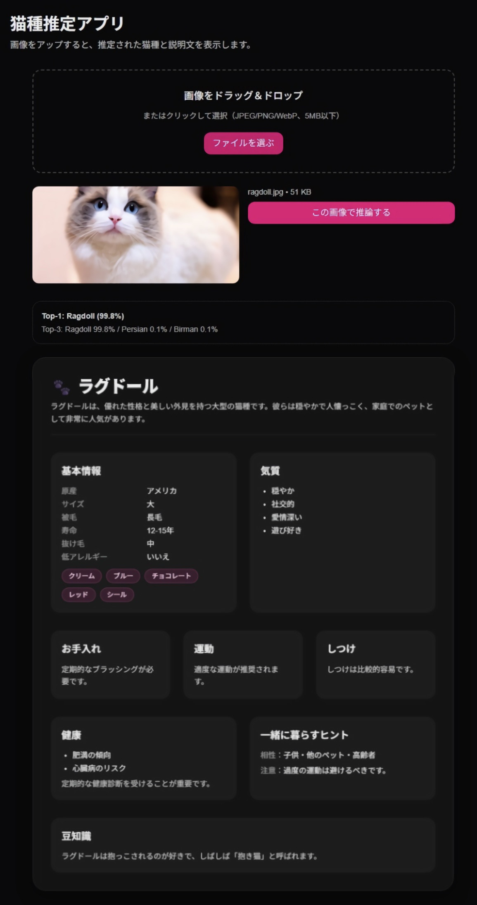

# 🗓 Week 5：GPT連携による猫種説明生成とUI統合

## 🎯 目的
Week4で構築した猫種分類推論APIの結果をもとに、  
OpenAI APIを用いて猫種ごとの特徴説明を自動生成する機能を追加する。  
バックエンドで説明生成API `/describe` を実装し、  
フロントエンドから推論結果に応じて説明文を取得・表示できるようにする。

---

## ✅ 成果物
| 項目 | 内容 |
|------|------|
| 説明生成API | `backend/app/routes/describe.py` |
| GPT連携 | OpenAI APIを利用して猫種説明文を自動生成 |
| 型定義 | `frontend/app/types/description.ts` に `BreedDescription` を定義 |
| フロント統合 | `fetchDescription.ts` 経由で `/describe` を呼び出し |
| 表示UI | `BreedDescriptionCard.tsx` で猫種の特徴をカード形式で表示 |
| API連携確認 | Swagger UI および Next.js UI上で動作確認済み |
| 機密管理 | `.env` に `OPENAI_API_KEY` を安全に格納（Git管理外） |

---

## 📂 ディレクトリ構成
```bash
catbreed-portfolio/
├── backend/
│   ├── app/
│   │   ├── routes/
│   │   │   ├── predict.py
│   │   │   └── describe.py
│   │   ├── __init__.py
│   │   └── main.py
│   │
│   └── .env
│
├── frontend/
│   ├── app/
│   │   ├── components/
│   │   │   ├── Upload.tsx
│   │   │   └── BreedDescriptionCard.tsx
│   │   ├── lib/
│   │   │   └── fetchDescription.ts
│   │   └── types/
│   │       └── description.ts
│   │
│   ├── .env.local
│   └── package.json
│
└── docs/
    ├── Week1_setup.md
    ├── Week2_setup.md
    ├── Week3_setup.md
    ├── Week4_setup.md
    └── Week5_setup.md
```

---

## ⚙️ 使用技術
- **バックエンド: FastAPI + OpenAI API**
- **フロントエンド: Next.js（TypeScript, TailwindCSS, App Router構成）**
- **通信: Fetch API / JSON**
- **説明生成: GPT（OpenAI API）による構造化JSON出力**
- **環境変数: .env と .env.local に分離管理**
- **UI: shadcn/ui（Card, Badgeなど）＋ Tailwindカスタムデザイン**

---

## 🧱 実装ステップ

### 1. 猫種説明生成APIの構築（FastAPI）

作成ファイル：
```bash
backend/app/routes/describe.py
```
主な処理内容：
```python
from fastapi import APIRouter, HTTPException
from openai import OpenAI
import json, os

router = APIRouter()

@router.post("/describe")
def describe_breed(request: dict):
    breed = request.get("breed")
    lang = request.get("lang", "ja")

    client = OpenAI(api_key=os.getenv("OPENAI_API_KEY"))
    prompt = f"""
    猫種「{breed}」について、以下の構造に沿って{lang}で説明してください:
    {{
      "breed": "",
      "overview": "",
      "key_facts": {{
          "origin": "", "size": "", "coat": "", "colors": [],
          "lifespan_years": "", "shedding": "", "hypoallergenic": false
      }},
      "temperament": [],
      "care": {{"grooming": "", "exercise": "", "training": ""}},
      "health": {{"common_issues": [], "notes": ""}},
      "living_with": {{"good_with": [], "cautions": []}},
      "fun_fact": ""
    }}
    """

    res = client.responses.create(model="gpt-4.1-mini", input=prompt)
    data = json.loads(res.output_text)
    return {"data": data}
```
- **✅** .env に OPENAI_API_KEY を設定（Git管理外）
- **✅** JSON構造で出力 → UIでそのままパース可能
- **✅** Swagger UIで "breed": "Ragdoll" を送信して動作確認済み

### 2. フロント側で説明取得処理を追加

作成ファイル：
```bash
frontend/app/lib/fetchDescription.ts
```
内容：
```ts
export async function fetchDescription(breed: string, lang = "ja") {
  const res = await fetch(`${process.env.NEXT_PUBLIC_API_URL}/describe`, {
    method: "POST",
    headers: { "Content-Type": "application/json" },
    body: JSON.stringify({ breed, lang }),
  });

  if (!res.ok) throw new Error("Failed to fetch description");
  const json = await res.json();
  return json.data;
}
```

### 3. 型定義の追加

作成ファイル：
```bash
frontend/app/types/description.ts
```
内容：
```ts
export type BreedDescription = {
  breed: string;
  overview: string;
  key_facts: {
    origin: string;
    size: string;
    coat: string;
    colors: string[];
    lifespan_years: string;
    shedding: string;
    hypoallergenic: boolean;
  };
  temperament: string[];
  care: {
    grooming: string;
    exercise: string;
    training: string;
  };
  health: {
    common_issues: string[];
    notes: string;
  };
  living_with: {
    good_with: string[];
    cautions: string[];
  };
  fun_fact: string;
};
```

### 4. 猫種説明カードUIを実装

作成ファイル：
```bash
frontend/app/components/BreedDescriptionCard.tsx
```
内容（主要部抜粋）：
```tsx
"use client";
import { Card, CardContent } from "@/components/ui/card";
import { Badge } from "@/components/ui/badge";
import { BreedDescription } from "../types/description";

export default function BreedDescriptionCard({ data }: { data: BreedDescription }) {
  return (
    <Card className="mt-6 rounded-2xl shadow-lg bg-muted/60">
      <CardContent className="p-6 space-y-5">
        <header>
          <h2 className="text-2xl font-bold">{data.breed}</h2>
          <p className="mt-2 opacity-80">{data.overview}</p>
        </header>

        {/* 基本情報 */}
        <section className="grid sm:grid-cols-2 gap-4">
          <div>
            <h3 className="font-semibold mb-2">基本情報</h3>
            <div className="text-sm grid grid-cols-2 gap-x-3 gap-y-1">
              <span className="opacity-60">原産</span><span>{data.key_facts.origin}</span>
              <span className="opacity-60">サイズ</span><span>{data.key_facts.size}</span>
              <span className="opacity-60">被毛</span><span>{data.key_facts.coat}</span>
            </div>
            <div className="mt-2 flex flex-wrap gap-2">
              {data.key_facts.colors.map((c, i) => (
                <Badge key={i} variant="secondary" className="rounded-xl">{c}</Badge>
              ))}
            </div>
          </div>
        </section>
      </CardContent>
    </Card>
  );
}
```

### 5. 結果をUIに統合

Upload.tsx 内の推論後に説明を取得：
```ts
const desc = await fetchDescription(predictedBreed, "ja");
setDescription(desc);
```
表示側で：
```tsx
{description && <BreedDescriptionCard data={description} />}
```

---

## 🧩 確認スクリーンショット



---

## 🧩 Week5の成果まとめ
| 項目                       | 状態                  |
| ------------------------ | ------------------- |
| `/describe` API構築        | ✅ 完了                |
| OpenAI連携・JSON出力対応        | ✅ 実装済み              |
| 型定義・構造化データ整備             | ✅ 完了                |
| フロント側fetch関数実装           | ✅ 完了                |
| 説明カードUI表示                | ✅ 完成                |
| `.env`と`.env.local`の分離管理 | ✅ 完了                |
| 全体動作確認                   | ✅ 成功（説明文＋推論結果が統合表示） |
