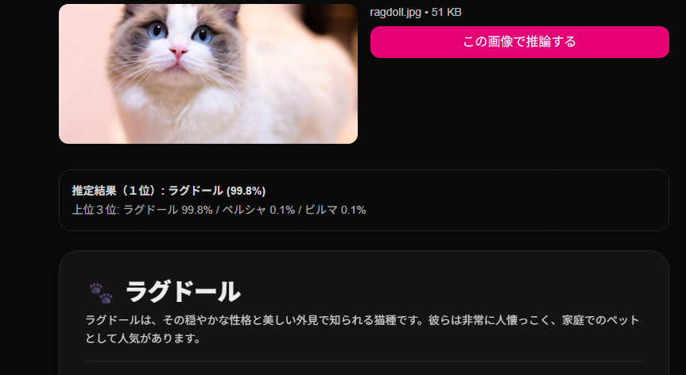
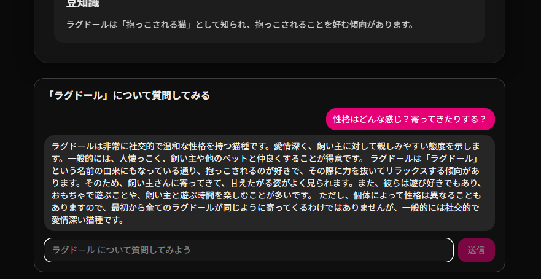

# 改修・追加実装ログ（Improvements）

このドキュメントでは、アプリ完成後に行った改善・追加機能の実装内容をまとめる。

---

## 🐾 1. 推論結果の日本語表記対応（Issue #1）

### 🔧 実施内容
- **`breed_mapping_ja.json` を作成し、英語 → 日本語の猫種名変換を実装**
- **FastAPI の `predict.py` 内で、返却直前にクラス名を日本語へ変換**
- **フロントの結果表示（Upload.tsx）を日本語表記に統一**
- **Page.tsx に残っていた重複表示を削除し、UI を一本化**

### 🎯 目的
- **推論結果とGPT説明文の表記を日本語に統一し、読みやすさ向上**
- **ポートフォリオとしての完成度を高める**

### ✅ 動作確認
- **12猫種すべてで日本語表記が適切に反映されることを確認**
- **CLASSES とマッピングキーのずれによる不一致も修正済み**

## 🧩 確認スクリーンショット

---

## 🐾 2. 推定された猫種に質問できる AIチャット機能 の実装（Issue #2）

### ✏ 実施内容
- **breed_chat.py を新規追加し、OpenAI Chat API を利用したチャット機能を実装**
- **.env の読み込みを明示的に行い、OPENAI_API_KEY の有無で挙動を切り替え**
- **FastAPI (app/main.py) に /breed_chat ルーターを追加**
- **fetchBreedChat.ts を新規作成し、チャットAPIと通信する関数を追加**
- **BreedChat.tsx を新規作成し、チャットUIを実装**
- **Upload.tsx にチャット欄を統合し、推論結果 → 説明文 → チャット という流れを構築**

## 🎯 目的
- **猫種に関してユーザーが自由に質問できるようにし、対話型アプリケーションへ進化させるため**
- **GPT API を用いたインタラクティブ機能として、ポートフォリオのアピールポイントを強化するため**
- **静的説明文だけでは伝えきれない「飼いやすさ」「性格」「注意点」など、個別質問に応じた情報提供を可能にするため**

## ✅ 動作確認
- **推論 → 説明文生成 → AIチャットの一連の流れが正常に動作することを確認**
- **日本語による質問に対し、自然な日本語回答が返ってくることを確認**
- **APIキー未設定時はチャット機能のみ 500 エラーを返し、アプリ全体は問題なく動作する仕様を確認**
- **メッセージ履歴がバブル形式で正しく表示されることを確認**

## 🧩 確認スクリーンショット

---